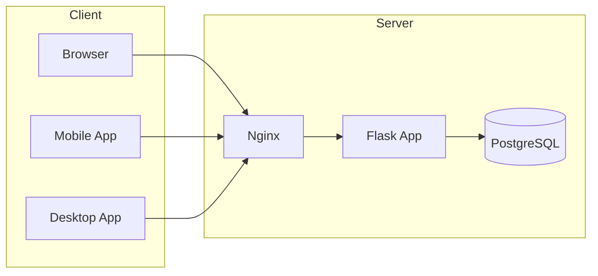
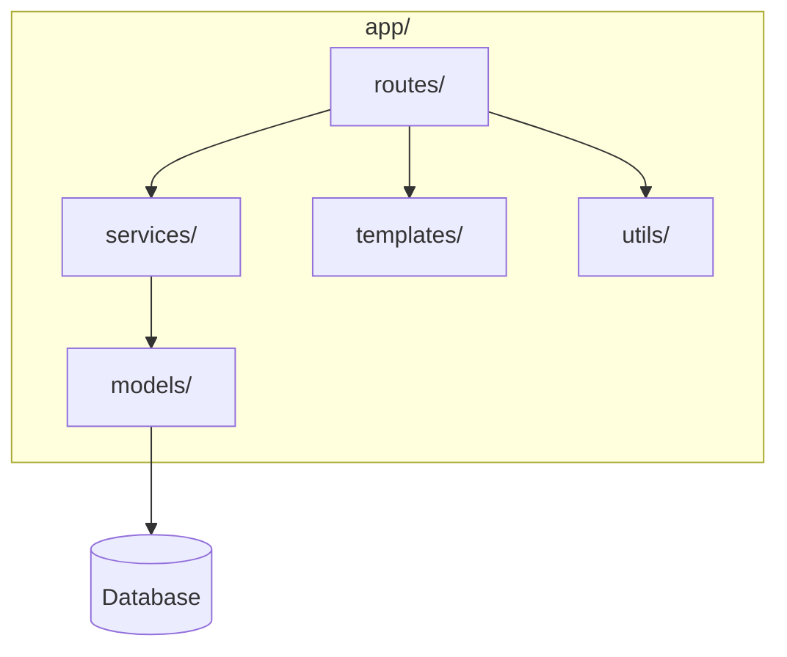

# TimeTracker Architecture

This document gives a high-level overview of the TimeTracker system for contributors and maintainers. For folder-level detail, see [Project Structure](docs/development/PROJECT_STRUCTURE.md). For migrating code to the service layer, see [Architecture Migration Guide](docs/implementation-notes/ARCHITECTURE_MIGRATION_GUIDE.md).

## System Overview

TimeTracker is a self-hosted web application for time tracking, project management, invoicing, and reporting. The core is a **Flask** app serving both HTML (server-rendered) and a **REST API**. Optional components include background jobs (APScheduler), real-time updates (WebSocket via Flask-SocketIO), and monitoring (Prometheus, Sentry, PostHog). Deployment is typically **Docker** with Nginx as reverse proxy and PostgreSQL as the primary database.

## Main Modules

| Layer | Location | Role |
|-------|----------|------|
| Entry point | `app.py` | Creates Flask app, loads config, registers blueprints via `blueprint_registry`, starts server (and optional SocketIO/scheduler). |
| Blueprint registry | `app/blueprint_registry.py` | Single place that imports and registers all route blueprints so `app/__init__.py` stays manageable. |
| Routes | `app/routes/` | HTTP handlers: auth, main (dashboard), projects, timer, reports, admin, api, api_v1, tasks, issues, invoices, clients, etc. |
| Services | `app/services/` | Business logic; routes call services instead of putting logic in view code. |
| Models | `app/models/` | SQLAlchemy ORM models (users, projects, time entries, tasks, clients, etc.). |
| Templates | `app/templates/` | Jinja2 HTML templates for server-rendered pages. |
| Utils | `app/utils/` | Helpers: timezone, validation, API responses, auth. |
| Desktop | `desktop/` | Electron-style desktop app (esbuild bundle) that talks to the API. |
| Mobile | `mobile/` | Flutter mobile app (iOS/Android) using the REST API. |
| Docker | `docker/`, root `Dockerfile` | Container build and runtime; optional Nginx, DB init scripts. |
| Tests | `tests/` | Pytest-based test suite. |

## Data Flow

- **Web request:** User or browser → Nginx (if used) → Flask → blueprint in `app/routes/` → optional **service** in `app/services/` → **models** and DB → response (HTML or JSON).
- **API request:** Same path; API blueprints (`api`, `api_v1`, `api_v1_time_entries`, etc.) return JSON and use token auth (see [API documentation](docs/api/REST_API.md)).
- **Real-time:** Flask-SocketIO is used for live timer updates; clients connect over WebSocket and receive events from the server.
- **Background:** APScheduler runs periodic tasks (e.g. reminders, cleanup) inside the app process.

API endpoints are versioned under `/api/v1/`. Authentication is session-based for the web UI and API-token (Bearer or `X-API-Key`) for the API.

## Backend vs Frontend

- **Backend:** Flask (Python), Jinja2, SQLAlchemy, Flask-Migrate, Flask-Login, Authlib (OIDC), Flask-SocketIO, APScheduler. Configuration via environment variables (see `env.example`).
- **Frontend:** Server-rendered HTML from Jinja2, styled with **Tailwind CSS**. JavaScript is used for interactivity (e.g. Chart.js, command palette, forms). The app can be used as a **PWA** (offline and installable). There is no separate SPA; the main UI is server-rendered with JS enhancements.
- **Native clients:** The **desktop** (Electron) and **mobile** (Flutter) apps are separate codebases that consume the REST API.

## Design Decisions

- **Service layer:** Business logic lives in `app/services/` so routes stay thin and logic is reusable and testable. See [Service Layer and Base CRUD](docs/development/SERVICE_LAYER_AND_BASE_CRUD.md) and the [Architecture Migration Guide](docs/implementation-notes/ARCHITECTURE_MIGRATION_GUIDE.md).
- **Blueprint registry:** All blueprints are registered from `app/blueprint_registry.py` to keep registration in one place and simplify adding new modules.
- **Database:** **PostgreSQL** is recommended for production; **SQLite** is supported for development and testing (e.g. `docker-compose.local-test.yml`).
- **API auth:** The REST API uses API tokens (created in Admin → Api-tokens) with scopes; no session cookies for API access.
- **Single codebase for web UI:** No separate frontend repo; templates and static assets live in the main repo under `app/templates/` and `app/static/`.

## Further Reading

- [Project Structure](docs/development/PROJECT_STRUCTURE.md) — Folder layout and file roles
- [Architecture Migration Guide](docs/implementation-notes/ARCHITECTURE_MIGRATION_GUIDE.md) — Moving routes to the service layer
- [REST API](docs/api/REST_API.md) — API reference and authentication
