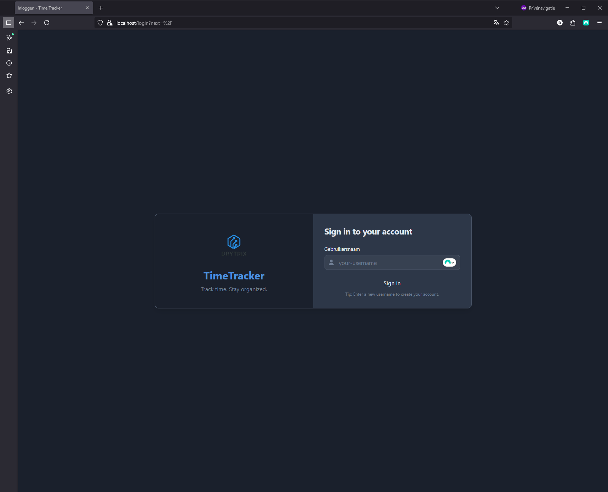
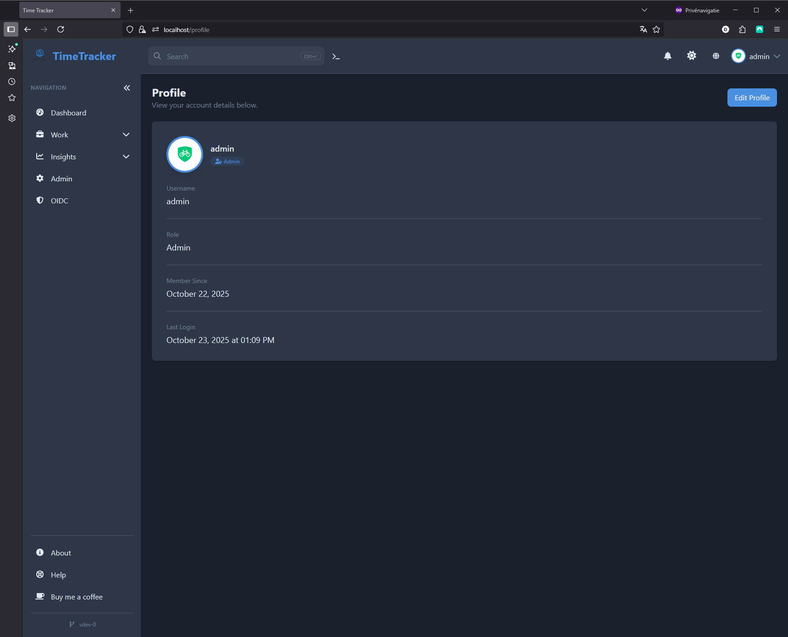
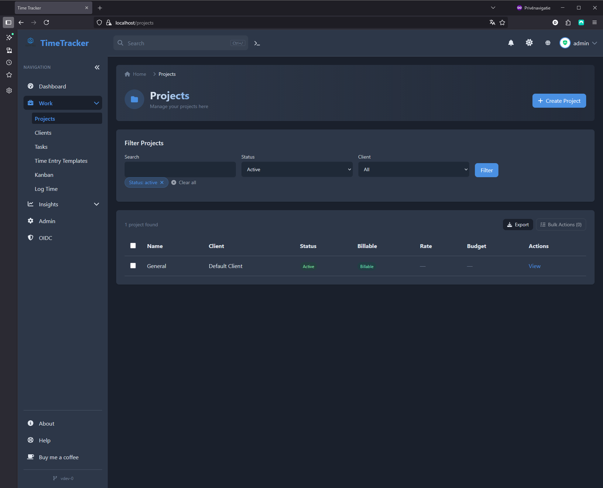

# TimeTracker

<div align="center">

### Professional Time Tracking & Project Management for Teams

**Track time. Manage projects. Generate invoices. All in one place.**

[🆕 What's New](#-whats-new) • [🚀 Quick Start](#-quick-start) • [✨ Features](#-features) • [📸 Screenshots](#-screenshots) • [📖 Getting Started](docs/GETTING_STARTED.md) • [📚 Documentation](docs/) • [🐳 Deploy](#-deployment)

---

</div>

## 🎯 What is TimeTracker?

TimeTracker is a **self-hosted, web-based time tracking application** designed for freelancers, teams, and businesses who need professional time management with complete control over their data.

**Perfect for:**
- 💼 **Freelancers** tracking billable hours across multiple clients
- 👥 **Small Teams** managing projects and tracking productivity
- 🏢 **Agencies** needing detailed reporting and client billing
- 🔒 **Privacy-focused organizations** wanting self-hosted solutions

---

## 🆕 What's New

TimeTracker has been continuously enhanced with powerful new features! Here's what's been added recently:

### 🎯 **Major Feature Additions**

#### 🧾 **Complete Invoicing System**
- **Professional Invoice Generation** — Convert tracked time directly into polished invoices
- **PDF Export** — Generate beautiful, branded PDF invoices with your company logo
- **Multi-Currency Support** — Invoice clients in their preferred currency
- **Tax Calculations** — Automatic tax computation with configurable rates
- **Invoice Status Tracking** — Monitor draft, sent, paid, and overdue invoices
- **Recurring Invoices** — Automate regular billing cycles
- **Email Integration** — Send invoices directly to clients from the platform

#### 📋 **Advanced Task Management**
- **Full Task System** — Create, assign, and track tasks with priorities and due dates
- **Kanban Board** — Visual drag-and-drop task management with customizable columns
- **Task Comments** — Collaborate with threaded comments on tasks
- **Task Activity Tracking** — See complete history of task changes and updates
- **Bulk Task Operations** — Manage multiple tasks at once

#### 💼 **Complete CRM Suite** 🆕
- **Multiple Contacts per Client** — Manage unlimited contacts for each client
- **Sales Pipeline** — Visual Kanban-style pipeline for tracking deals and opportunities
- **Deal Management** — Track deal value, probability, stages, and close dates
- **Lead Management** — Capture, score, and convert leads into clients or deals
- **Communication History** — Track all emails, calls, meetings, and notes with contacts
- **Deal & Lead Activities** — Complete activity tracking for sales processes

#### ⏱️ **Enhanced Time Tracking**
- **Calendar View** — Visual calendar interface for viewing and managing time entries
- **Bulk Time Entry** — Create multiple time entries for consecutive days with weekend skipping
- **Time Entry Templates** — Save and reuse common time entries for faster logging
- **Real-time Updates** — See live timer updates across all devices via WebSocket

#### 💰 **Financial Management**
- **Expense Tracking** — Track business expenses with receipts, categories, and approval workflows
- **Payment Tracking** — Monitor invoice payments with multiple payment methods
- **Billable Expenses** — Mark expenses as billable and automatically include in invoices
- **Reimbursement Management** — Handle expense approvals and reimbursements

#### 🔐 **Enterprise Security & Access**
- **Role-Based Access Control (RBAC)** — Granular permissions system with custom roles
- **OIDC/SSO Authentication** — Enterprise authentication support (Azure AD, Authelia, etc.)
- **API Tokens** — Generate secure tokens for API access and integrations
- **Audit Logs** — Track all system activity and user actions

#### ⌨️ **Productivity Power-Ups**
- **Command Palette** — Keyboard-driven navigation (press `?` to open)
- **Keyboard Shortcuts** — 50+ shortcuts for lightning-fast navigation
- **Quick Search** — Fast search across projects, tasks, clients, and more (Ctrl+K)
- **Saved Filters** — Save frequently used report filters for instant access

#### ✏️ **Content & Formatting**
- **Markdown Support** — Rich text formatting in project and task descriptions
- **Enhanced UI Components** — Modern, accessible interface components
- **Toast Notifications** — Beautiful in-app notifications for actions and updates

#### 🎨 **Modern UX & Layout Enhancements** 🆕
- **Enterprise-Grade Tables** — Sortable columns, bulk actions, inline editing, and CSV export
- **Enhanced Search** — Instant search with autocomplete, recent searches, and categorized results (Ctrl+K)
- **Data Visualization** — Interactive charts with Chart.js (6 chart types, responsive, exportable)
- **Progressive Web App (PWA)** — Install as mobile app, offline support, background sync
- **Accessibility Excellence** — WCAG 2.1 AA compliant, keyboard navigation, screen reader support
- **Interactive Onboarding** — Step-by-step product tours for new users
- **Advanced Forms** — Auto-save, form state persistence, inline validation, smart defaults
- **Design System** — Unified component library with 20+ reusable UI components
- **Loading States** — Skeleton components and loading indicators throughout
- **Enhanced Empty States** — Beautiful, actionable empty states with guidance

#### 🏗️ **Architecture & Performance Improvements** 🆕
- **Service Layer Migration** — Routes migrated to service layer pattern for better maintainability
- **Query Optimization** — Fixed N+1 query problems, reduced database queries by 80-90%
- **Environment Validation** — Comprehensive startup validation with helpful error messages
- **Base CRUD Service** — Reusable service classes reducing code duplication
- **API Token Security** — Enhanced token management with rotation, expiration, and scoping

---

## ✨ Features

TimeTracker includes **130+ features** across 13 major categories. See the [Complete Features Documentation](docs/FEATURES_COMPLETE.md) for a comprehensive overview.

### ⏱️ **Smart Time Tracking**
- **One-Click Timers** — Start tracking with a single click
- **Persistent Timers** — Timers keep running even after browser closes
- **Idle Detection** — Automatic pause after configurable idle time
- **Manual Entry** — Add historical time entries with notes and tags
- **Bulk Time Entry** — Create multiple entries for consecutive days with weekend skipping
- **Time Entry Templates** — Save and reuse common time entries for faster logging
- **Calendar View** — Visual calendar interface for viewing and managing time entries
- **Focus Sessions** — Pomodoro-style focus session tracking
- **Recurring Time Blocks** — Weekly recurring time block templates
- **Time Rounding** — Configurable rounding intervals
- **Real-time Updates** — See live timer updates across all devices via WebSocket

### 📊 **Project & Task Management**
- **Unlimited Projects & Tasks** — Organize work your way
- **Client Management** — Store client details, contacts, and billing rates
- **Task Board** — Visual task management with priorities and assignments
- **Kanban Board** — Drag-and-drop task management with customizable columns
- **Status Tracking** — Monitor progress from to-do to completion
- **Budget Tracking** — Monitor project budgets with alerts and forecasting
- **Project Costs** — Track direct project expenses
- **Task Comments** — Collaborate with threaded comments on tasks
- **Markdown Support** — Rich text formatting in project and task descriptions
- **Project Favorites** — Quick access to frequently used projects

### 💼 **CRM & Sales Management** 🆕
- **Multiple Contacts per Client** — Manage unlimited contacts with roles and designations
- **Sales Pipeline** — Visual Kanban-style pipeline for tracking deals and opportunities
- **Deal Management** — Track deal value, probability, stages, and expected close dates
- **Lead Management** — Capture, score, and convert leads into clients or deals
- **Communication History** — Track all emails, calls, meetings, and notes with contacts
- **Deal Activities** — Complete activity tracking for sales processes
- **Lead Activities** — Track all interactions and activities for leads
- **Lead Scoring** — Automated lead scoring (0-100) for prioritization
- **Lead Conversion** — Convert leads to clients or deals with one click

### 🧾 **Professional Invoicing**
- **Generate from Time** — Convert tracked hours to invoices automatically
- **Custom Line Items** — Add manual items for expenses or services
- **Tax Calculation** — Automatic tax calculations with configurable rates
- **PDF Export** — Professional PDF invoice generation with customizable layouts
- **Status Tracking** — Track draft, sent, paid, and overdue invoices
- **Company Branding** — Add logos and custom company information
- **Expense Integration** — Include tracked expenses in invoices
- **Recurring Invoices** — Automate recurring billing
- **Multi-Currency** — Support for multiple currencies with conversion
- **Invoice Email** — Send invoices directly to clients

### 💰 **Financial Management**
- **Expense Tracking** — Track business expenses with receipts and categories
- **Payment Tracking** — Monitor invoice payments and payment methods
- **Reimbursement Management** — Handle expense approvals and reimbursements
- **Billable Expenses** — Mark expenses as billable and add to invoices
- **Payment Gateway Integration** — Track gateway transactions and fees
- **Mileage Tracking** — Track business mileage with rate calculation
- **Per Diem Tracking** — Manage per diem expenses and rates
- **Multi-Currency** — Support for multiple currencies with conversion

### 📈 **Analytics & Reporting**
- **Visual Dashboards** — Charts and graphs for quick insights
- **Detailed Reports** — Time breakdown by project, user, or date range
- **CSV Export** — Export data for external analysis
- **Billable vs Non-billable** — Separate tracking for accurate billing
- **Custom Date Ranges** — Flexible reporting periods
- **Saved Filters** — Save frequently used report filters for quick access
- **User Analytics** — Individual performance metrics and productivity insights
- **Budget Alerts** — Automatic alerts when budget thresholds are exceeded
- **Budget Forecasting** — Predict project completion dates based on burn rates
- **Weekly Time Goals** — Set and track weekly hour targets
- **Overtime Tracking** — Monitor and report overtime hours

### 🔐 **Multi-User & Security**
- **Role-Based Access Control** — Granular permissions system with custom roles
- **User Management** — Add team members and manage access
- **Self-Hosted** — Complete control over your data
- **Flexible Authentication** — Username-only, OIDC/SSO (Azure AD, Authelia, etc.)
- **Session Management** — Secure cookies and session handling
- **Profile Pictures** — Users can upload profile pictures
- **API Tokens** — Generate tokens for API access and integrations
- **Audit Logs** — Track all system activity and user actions

### ⌨️ **Productivity Features**
- **Command Palette** — Keyboard-driven navigation with shortcuts (press `?`)
- **Keyboard Shortcuts** — 50+ shortcuts for lightning-fast navigation and actions
- **Quick Search** — Enhanced instant search with autocomplete and categorized results (Ctrl+K)
- **Quick Actions Menu** — Floating action button with 6 quick actions (bottom-right)
- **Enhanced Data Tables** — Sortable, filterable, inline-editable tables with bulk operations
- **Email Notifications** — Configurable email alerts for tasks, invoices, and more
- **Toast Notifications** — Beautiful in-app notifications for actions and updates
- **Weekly Summaries** — Optional weekly time tracking summaries via email
- **Activity Feed** — Track recent activity across the system
- **Saved Filters** — Save frequently used report filters for quick access
- **Recently Viewed** — Quick access to recently viewed items
- **Favorites System** — Mark frequently used projects, clients, and tasks as favorites

### 🛠️ **Technical Excellence**
- **Docker Ready** — Deploy in minutes with Docker Compose
- **Database Flexibility** — PostgreSQL for production, SQLite for testing
- **Responsive Design** — Mobile-first design works perfectly on desktop, tablet, and mobile
- **Real-time Sync** — WebSocket support for live updates across devices
- **Automatic Backups** — Scheduled database backups (configurable)
- **Progressive Web App (PWA)** — Install as mobile app with offline support and background sync
- **Monitoring Stack** — Built-in Prometheus, Grafana, Loki for observability
- **Internationalization** — Multiple language support (i18n) with translation system
- **REST API** — Comprehensive REST API with token authentication and scoping
- **HTTPS Support** — Automatic HTTPS setup with self-signed or trusted certificates
- **Modern Architecture** — Service layer pattern, repository pattern, schema validation
- **Performance Optimized** — Query optimization, eager loading, reduced N+1 queries
- **Accessibility** — WCAG 2.1 AA compliant with full keyboard navigation and screen reader support

---

## 📸 Screenshots

<div align="center">

### 🏠 Dashboard — Your Command Center


*Start timers, view recent entries, and see your productivity at a glance*

---

### 🔐 Simple Login & User Management
<div>
  
  
</div>

*Simple username-based authentication and customizable user profiles with avatar support*

---

### 📁 Projects & Tasks — Stay Organized
<div>
  
  
</div>

*Manage multiple projects and break them down into actionable tasks*

---

### 📋 Kanban Board — Visual Task Management


*Drag-and-drop task management with customizable columns and visual workflow*

---

### ⏱️ Time Tracking — Flexible & Powerful
<div>
  
  
</div>

*Manual time entry and reusable templates for faster logging*

---

### 🧾 Invoicing & Clients — Professional Billing
<div>
  
  
</div>

*Generate invoices from tracked time and manage client relationships*

---

### 📊 Reports & Analytics — Data-Driven Insights
<div>
  
  
</div>

*Comprehensive reporting and user analytics for informed decisions*

---

### 🛠️ Admin Dashboard — Complete Control


*Manage users, configure settings, and monitor system health*

---

### 🎯 Easy Creation — Streamlined Workflows
<div>
  
  
  
</div>

*Simple, intuitive forms for creating projects, tasks, and clients*

</div>

---

## 🚀 Quick Start

### Option 1: Docker with HTTPS (Recommended for Production)

Get TimeTracker running in under 2 minutes with automatic HTTPS:

```bash
# Clone the repository
git clone https://github.com/drytrix/TimeTracker.git
cd TimeTracker

# Create your environment file from the template
cp env.example .env

# IMPORTANT: Edit .env and set a strong SECRET_KEY
# Generate one with: python -c "import secrets; print(secrets.token_hex(32))"
# Also set your timezone (TZ) and currency (CURRENCY)
nano .env  # or use any text editor

# Start with Docker Compose (includes HTTPS via nginx with self-signed cert)
docker-compose up -d

# Access at https://localhost
# Your browser will warn about the self-signed certificate - that's normal
```

**First login creates the admin account** — just enter your username!

**📖 See the complete setup guide:** [`docs/DOCKER_COMPOSE_SETUP.md`](docs/DOCKER_COMPOSE_SETUP.md)

### Option 2: Docker with Plain HTTP (Development/Testing)

For local development or testing without HTTPS:

```bash
# Clone and navigate to the repository
git clone https://github.com/drytrix/TimeTracker.git
cd TimeTracker

# Use the example compose file that exposes HTTP directly
docker-compose -f docker-compose.example.yml up -d

# Access at http://localhost:8080
```

### Option 3: Quick Test with SQLite

Want to try it out without any configuration?

```bash
# Clone the repository
git clone https://github.com/drytrix/TimeTracker.git
cd TimeTracker

# Start with the local test configuration (uses SQLite, no PostgreSQL)
docker-compose -f docker-compose.local-test.yml up --build

# Access at http://localhost:8080
```

No database setup or .env file needed — perfect for quick testing!

---

## 💡 Use Cases

### For Freelancers
Track time across multiple client projects, generate professional invoices, and understand where your time goes. TimeTracker helps you bill accurately and identify your most profitable clients.

### For Teams
Assign tasks, track team productivity, and generate reports for stakeholders. See who's working on what, identify bottlenecks, and optimize team performance.

### For Agencies
Manage multiple clients and projects simultaneously. Track billable hours, generate client invoices, and analyze project profitability — all in one place.

### For Personal Projects
Even if you're not billing anyone, understanding where your time goes is valuable. Track personal projects, hobbies, and learning activities to optimize your time.

---

## 🌟 Why TimeTracker?

| Feature | TimeTracker | Traditional Time Trackers |
|---------|-------------|---------------------------|
| **Self-Hosted** | ✅ Complete data control | ❌ Cloud-only, subscription fees |
| **Open Source** | ✅ Free to use & modify | ❌ Proprietary, locked features |
| **Persistent Timers** | ✅ Runs server-side | ❌ Browser-dependent |
| **Docker Ready** | ✅ Deploy anywhere | ⚠️ Complex setup |
| **Invoicing Built-in** | ✅ Track to bill workflow | ❌ Requires integration |
| **No User Limits** | ✅ Unlimited users | ❌ Per-user pricing |

---

## 📚 Documentation

Comprehensive documentation is available in the [`docs/`](docs/) directory:

### Getting Started
- **[📖 Getting Started Guide](docs/GETTING_STARTED.md)** — Complete beginner's guide (⭐ Start here!)
- **[Installation Guide](docs/DOCKER_PUBLIC_SETUP.md)** — Detailed setup instructions
- **[Requirements](docs/REQUIREMENTS.md)** — System requirements and dependencies
- **[Troubleshooting](docs/DOCKER_STARTUP_TROUBLESHOOTING.md)** — Common issues and solutions
- **[CSRF Token Issues](CSRF_TROUBLESHOOTING.md)** — Fix "CSRF token missing or invalid" errors
- **[CSRF IP Access Fix](CSRF_IP_ACCESS_FIX.md)** — 🔥 Fix cookies not working when accessing via IP address
- **[HTTPS Auto-Setup](README_HTTPS_AUTO.md)** — 🚀 Automatic HTTPS at startup (one command!)
- **[HTTPS Manual Setup (mkcert)](README_HTTPS.md)** — 🔒 Manual HTTPS with no certificate warnings

### Features
- **[📋 Complete Features Overview](docs/FEATURES_COMPLETE.md)** — Comprehensive documentation of all 120+ features (⭐ Complete reference!)
- **[Task Management](docs/TASK_MANAGEMENT_README.md)** — Break projects into manageable tasks
- **[Invoice System](docs/INVOICE_FEATURE_README.md)** — Generate professional invoices
- **[Client Management](docs/CLIENT_MANAGEMENT_README.md)** — Manage client relationships
- **[Calendar Features](docs/CALENDAR_FEATURES_README.md)** — Calendar and bulk entry features
- **[Bulk Time Entry](docs/BULK_TIME_ENTRY_README.md)** — Create multiple time entries at once
- **[Command Palette](docs/COMMAND_PALETTE_USAGE.md)** — Keyboard shortcuts for power users
- **[Expense Tracking](docs/EXPENSE_TRACKING.md)** — Track business expenses
- **[Payment Tracking](docs/PAYMENT_TRACKING.md)** — Track invoice payments
- **[Budget Alerts & Forecasting](docs/BUDGET_ALERTS_AND_FORECASTING.md)** — Monitor project budgets
- **[Weekly Time Goals](docs/WEEKLY_TIME_GOALS.md)** — Set and track weekly hour targets
- **[Role-Based Permissions](docs/ADVANCED_PERMISSIONS.md)** — Granular access control

### Technical Documentation
- **[Project Structure](docs/PROJECT_STRUCTURE.md)** — Codebase architecture
- **[Database Migrations](migrations/README.md)** — Database schema management
- **[Version Management](docs/VERSION_MANAGEMENT.md)** — Release and versioning
- **[CSRF Configuration](docs/CSRF_CONFIGURATION.md)** — Security and CSRF token setup for Docker
- **[CI/CD Documentation](docs/cicd/)** — Continuous integration setup

### Contributing
- **[Contributing Guidelines](docs/CONTRIBUTING.md)** — How to contribute
- **[Code of Conduct](docs/CODE_OF_CONDUCT.md)** — Community standards

---

## 🐳 Deployment

### Local Development
```bash
# Start with HTTPS (recommended)
docker-compose up -d

# Or use plain HTTP for development
docker-compose -f docker-compose.example.yml up -d
```

### Production Deployment

#### Option 1: Build from Source
```bash
# Clone the repository
git clone https://github.com/drytrix/TimeTracker.git
cd TimeTracker

# Configure your .env file
cp env.example .env
# Edit .env with production settings:
# - Set a strong SECRET_KEY: python -c "import secrets; print(secrets.token_hex(32))"
# - Configure TZ (timezone) and CURRENCY
# - Set PostgreSQL credentials (POSTGRES_PASSWORD, etc.)

# Start the application
docker-compose up -d
```

#### Option 2: Use Pre-built Images
```bash
# Use the remote compose file with published images
docker-compose -f docker-compose.remote.yml up -d
```

> **⚠️ Security Note:** Always set a unique `SECRET_KEY` in production! See [CSRF Configuration](docs/CSRF_CONFIGURATION.md) for details.

### Raspberry Pi Deployment
TimeTracker runs perfectly on Raspberry Pi 4 (2GB+ RAM):
```bash
# Same Docker commands work on ARM architecture
docker-compose up -d
```

### HTTPS Configuration

#### Automatic HTTPS (Easiest)
```bash
# Uses self-signed certificates (generated automatically)
docker-compose up -d
# Access at https://localhost (accept browser warning)
```

#### Manual HTTPS with mkcert (No Browser Warnings)
```bash
# Use mkcert for locally-trusted certificates
docker-compose -f docker-compose.https-mkcert.yml up -d
```
**📖 See [HTTPS Setup Guide](README_HTTPS.md) for detailed instructions**

### Monitoring & Analytics
```bash
# Deploy with full monitoring stack (Prometheus, Grafana, Loki)
docker-compose up -d
# Grafana: http://localhost:3000
# Prometheus: http://localhost:9090
```

**📖 See [Deployment Guide](docs/DOCKER_PUBLIC_SETUP.md) for detailed instructions**  
**📖 See [Docker Compose Setup](docs/DOCKER_COMPOSE_SETUP.md) for configuration options**

---

## 🔧 Configuration

TimeTracker is highly configurable through environment variables. For a comprehensive list and recommended values, see:

- [`docs/DOCKER_COMPOSE_SETUP.md`](docs/DOCKER_COMPOSE_SETUP.md)
- [`env.example`](env.example)

Common settings:

```bash
# Timezone and locale
TZ=America/New_York
CURRENCY=USD

# Timer behavior
SINGLE_ACTIVE_TIMER=true
IDLE_TIMEOUT_MINUTES=30
ROUNDING_MINUTES=1

# User management
ADMIN_USERNAMES=admin,manager
ALLOW_SELF_REGISTER=false

# Security (production)
SECRET_KEY=your-secure-random-key
SESSION_COOKIE_SECURE=true
```

---

## 📊 Analytics & Telemetry

TimeTracker includes **optional** analytics and monitoring features to help improve the application and understand how it's being used. All analytics features are:

- ✅ **Disabled by default** — You must explicitly opt-in
- ✅ **Privacy-first** — No personally identifiable information (PII) is collected
- ✅ **Self-hostable** — Run your own analytics infrastructure
- ✅ **Transparent** — All data collection is documented

### What We Collect (When Enabled)

#### 1. **Structured Logs** (Always On, Local Only)
- Request logs and error messages stored **locally** in `logs/app.jsonl`
- Used for troubleshooting and debugging
- **Never leaves your server**

#### 2. **Prometheus Metrics** (Always On, Self-Hosted)
- Request counts, latency, and performance metrics
- Exposed at `/metrics` endpoint for your Prometheus server
- **Stays on your infrastructure**

#### 3. **Error Monitoring** (Optional - Sentry)
- Captures uncaught exceptions and performance issues
- Helps identify and fix bugs quickly
- **Opt-in:** Set `SENTRY_DSN` environment variable

#### 4. **Product Analytics** (Optional - PostHog)
- Tracks feature usage and user behavior patterns with advanced features:
  - **Person Properties**: Role, auth method, login history
  - **Feature Flags**: Gradual rollouts, A/B testing, kill switches
  - **Group Analytics**: Segment by version, platform, deployment
  - **Rich Context**: Browser, device, environment on every event
- **Opt-in:** Set `POSTHOG_API_KEY` environment variable
- See [POSTHOG_ADVANCED_FEATURES.md](POSTHOG_ADVANCED_FEATURES.md) for complete guide

#### 5. **Installation Telemetry** (Optional, Anonymous)
- Sends anonymous installation data via PostHog with:
  - Anonymized fingerprint (SHA-256 hash, cannot be reversed)
  - Application version
  - Platform information
- **No PII:** No IP addresses, usernames, or business data
- **Opt-in:** Set `ENABLE_TELEMETRY=true` and `POSTHOG_API_KEY` environment variables

### How to Enable Analytics

```bash
# Enable Sentry error monitoring (optional)
SENTRY_DSN=https://your-sentry-dsn@sentry.io/project-id
SENTRY_TRACES_RATE=0.1  # 10% sampling for performance traces

# Enable PostHog product analytics (optional)
POSTHOG_API_KEY=your-posthog-api-key
POSTHOG_HOST=https://app.posthog.com

# Enable anonymous telemetry (optional, uses PostHog)
ENABLE_TELEMETRY=true
TELE_SALT=your-unique-salt
APP_VERSION=1.0.0
```

### Self-Hosting Analytics

You can self-host all analytics services for complete control:

```bash
# Use docker-compose with monitoring profile
docker-compose --profile monitoring up -d
```

This starts:
- **Prometheus** — Metrics collection and storage
- **Grafana** — Visualization dashboards
- **Loki** (optional) — Log aggregation
- **Promtail** (optional) — Log shipping

### Privacy & Data Protection

> **Telemetry**: TimeTracker can optionally send anonymized usage data to help improve the product (errors, feature usage, install counts). All telemetry is **opt-in**. No personal data is collected. To disable telemetry, set `ENABLE_TELEMETRY=false` or simply don't set the environment variable (disabled by default).

**What we DON'T collect:**
- ❌ Email addresses or usernames
- ❌ IP addresses
- ❌ Project names or descriptions
- ❌ Time entry notes or client data
- ❌ Any personally identifiable information (PII)

**Your rights:**
- 📥 **Access**: View all collected data
- ✏️ **Rectify**: Correct inaccurate data
- 🗑️ **Erase**: Delete your data at any time
- 📤 **Export**: Export your data in standard formats

**📖 See [Privacy Policy](docs/privacy.md) for complete details**  
**📖 See [Analytics Documentation](docs/analytics.md) for configuration**  
**📖 See [Events Schema](docs/events.md) for tracked events**

---

## 🛣️ Roadmap

### Planned Features
- 🎨 **Custom Themes** — Personalize your interface with custom color schemes
- 📊 **Advanced Analytics** — More charts, insights, and reporting options
- 🔌 **API Extensions** — Additional RESTful API endpoints for integrations
- 🔔 **Push Notifications** — Real-time browser notifications
- 📱 **Mobile App** — Native iOS and Android apps
- 🤖 **Automation Rules** — Automated workflows and task assignments
- 📈 **Advanced Forecasting** — AI-powered project timeline predictions

### 🎉 Recently Added Features

#### 💼 Business & CRM Features
- ✅ **Complete CRM Suite** — Multiple contacts, sales pipeline, deal tracking, and lead management
- ✅ **Invoice Generation** — Full invoicing system with PDF export, multi-currency, and tax calculations
- ✅ **Expense Tracking** — Comprehensive expense management with receipts and categories
- ✅ **Payment Tracking** — Monitor invoice payments with multiple payment methods
- ✅ **Recurring Invoices** — Automate recurring billing cycles

#### 📋 Project & Task Management
- ✅ **Task Management System** — Complete task tracking with priorities, assignments, and due dates
- ✅ **Kanban Board** — Visual drag-and-drop task management with customizable columns
- ✅ **Task Comments** — Threaded collaboration with comments on tasks
- ✅ **Task Activity Tracking** — Complete history of all task changes

#### ⏱️ Time Tracking Enhancements
- ✅ **Calendar View** — Visual calendar interface for viewing and managing time entries
- ✅ **Bulk Time Entry** — Create multiple entries for consecutive days with weekend skipping
- ✅ **Time Entry Templates** — Save and reuse common time entries for faster logging
- ✅ **Real-time Updates** — Live timer synchronization across all devices via WebSocket

#### 🔐 Security & Access Control
- ✅ **Role-Based Permissions (RBAC)** — Granular access control system with custom roles
- ✅ **OIDC/SSO Authentication** — Enterprise authentication support (Azure AD, Authelia, etc.)
- ✅ **API Tokens** — Secure token generation for API access and integrations
- ✅ **Audit Logs** — Complete system activity and user action tracking

#### ⌨️ Productivity Features
- ✅ **Command Palette** — Keyboard-driven navigation (press `?` to open)
- ✅ **Keyboard Shortcuts** — 50+ shortcuts for power users
- ✅ **Quick Search** — Fast search across all entities (Ctrl+K)
- ✅ **Saved Filters** — Save frequently used report filters for quick access

#### ✨ User Experience
- ✅ **Modern UX & Layout** — Complete UI/UX overhaul with 16 major improvements
- ✅ **Enterprise-Grade Tables** — Sortable, filterable, inline-editable tables with bulk actions
- ✅ **Enhanced Search** — Instant search with autocomplete and categorized results
- ✅ **Data Visualization** — Interactive charts with Chart.js integration
- ✅ **Progressive Web App** — Full PWA capabilities with offline support
- ✅ **Accessibility Excellence** — WCAG 2.1 AA compliant with full keyboard navigation
- ✅ **Interactive Onboarding** — Step-by-step product tours for new users
- ✅ **Design System** — Unified component library with 20+ reusable components
- ✅ **Markdown Support** — Rich text formatting in descriptions
- ✅ **Toast Notifications** — Beautiful in-app notification system
- ✅ **Enhanced UI Components** — Modern, accessible interface elements

#### 🏗️ Architecture & Performance
- ✅ **Service Layer Migration** — Routes migrated to service layer pattern
- ✅ **Query Optimization** — Fixed N+1 queries, reduced database queries by 80-90%
- ✅ **Environment Validation** — Comprehensive startup validation
- ✅ **Base CRUD Services** — Reusable service classes reducing code duplication
- ✅ **API Token Security** — Enhanced token management with rotation and scoping

---

## 🤝 Contributing

We welcome contributions! Whether it's:

- 🐛 **Bug Reports** — Help us identify issues
- 💡 **Feature Requests** — Share your ideas
- 📝 **Documentation** — Improve our docs
- 💻 **Code Contributions** — Submit pull requests

**📖 See [Contributing Guidelines](docs/CONTRIBUTING.md) to get started**

---

## 📄 License

TimeTracker is licensed under the **GNU General Public License v3.0**.

This means you can:
- ✅ Use it commercially
- ✅ Modify and adapt it
- ✅ Distribute it
- ✅ Use it privately

**See [LICENSE](LICENSE) for full details**

---

## 🆘 Support

- 📖 **Documentation**: Check the [`docs/`](docs/) directory
- 🐛 **Bug Reports**: [Open an issue](https://github.com/drytrix/TimeTracker/issues)
- 💬 **Discussions**: [GitHub Discussions](https://github.com/drytrix/TimeTracker/discussions)
- 📧 **Contact**: [Create an issue](https://github.com/drytrix/TimeTracker/issues) for support

---

## ⭐ Star Us!

If TimeTracker helps you track your time better, consider giving us a star on GitHub! It helps others discover the project.

<div align="center">

**[⭐ Star on GitHub](https://github.com/drytrix/TimeTracker)**

---

**Built with ❤️ for the time-tracking community**

</div>
