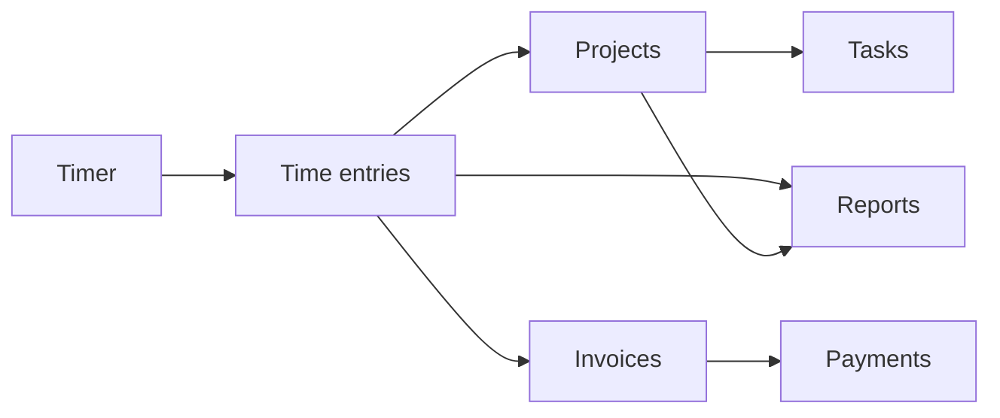

# TimeTracker Product / UX / Technical Audit

This document audits the product surface, navigation, terminology, and documentation to improve coherence, reduce friction, and clarify feature ownership. It was produced as part of the Product Surface Audit and Improvements initiative.

---

## 1. Core vs secondary features

### Core (main value proposition: track time → projects → bill/invoice → report)

- **Timer** and **Time entries** — Log, review, and export logged time.
- **Projects** and **Tasks** — Organize work.
- **Clients** — Who you bill.
- **Invoices** and **Payments** — Billing.
- **Reports** — Time, project, user, summary, unpaid hours, etc.

These map to the tagline: *Track time. Manage projects. Generate invoices.*

### Secondary / optional (module toggles)

- **CRM**: Deals, Leads, Quotes, Contacts (via Clients).
- **Finance expansion**: Recurring Invoices, Invoice Approvals, Payment Gateways, Expenses, Mileage, Per Diem, Budget Alerts.
- **Work & capacity**: Calendar, Gantt, Kanban, Issues, Weekly Goals, Project Templates, Time Entry Templates, Workforce, Time Approvals.
- **Other**: Inventory, Analytics, Kiosk, Integrations, Import/Export, Saved Filters.
- **Admin**: Users, roles, PDF templates, system settings, security, data management, maintenance.

**References:** [README.md](../README.md), [GETTING_STARTED.md](GETTING_STARTED.md) (Core Workflows), implementation notes (core workflows: timers, entries, invoices, reports).

---

## 2. Overloaded screens

| Screen | Location | Why it feels heavy |
|--------|----------|---------------------|
| Main dashboard | `app/templates/main/dashboard.html` | Timer hero, multiple stat grids, many widgets |
| Help | `app/templates/main/help.html` | Very long; many sections and grids |
| Time entries overview | `app/templates/timer/time_entries_overview.html` | Dense filters, summary cards, large list |
| Projects list | `app/templates/projects/list.html` | Filters + custom fields + table + modals |
| Project view | `app/templates/projects/view.html` | 3-column layout, details + tasks + actions |
| Admin settings | `app/templates/admin/settings.html` | Single long form: General, Timers, Time Entry, Branding, Invoices, Peppol, Backup, Kiosk, Analytics |
| Invoice/Quote PDF layout | `app/templates/admin/pdf_layout.html`, `quote_pdf_layout.html` | 4000–5000 lines; canvas editor, sidebar tabs, heavy JS |
| Invoice/Quote edit | `app/templates/invoices/edit.html`, `app/templates/quotes/edit.html` | 3-column, dynamic line items (time, expenses, goods) |
| Client edit | `app/templates/clients/edit.html` | Many fields, nested grids |
| User settings | `app/templates/user/settings.html` | Long form, many options |

**Recommendation:** Prioritise splitting Admin Settings into tabbed or grouped sections, and optionally breaking Help into subpages or collapsible sections. PDF editors are inherently complex; document expected usage rather than restructuring in this pass.

---

## 3. Confusing navigation and flows

- **Duplicate entry points:** Top-level **Timer** and **Time Tracking → Log Time** both go to the same manual entry page. One is redundant.
- **Reports buried under Finance:** On desktop, Reports (All Reports, Report Builder, Saved Views, Scheduled Reports) live only under **Finance & Expenses**. On mobile, Reports is a first-class bottom nav item. Desktop users must open Finance to reach Reports even though reports are part of the core value (time → reports).
- **Contacts:** In the CRM dropdown, **Contacts** is shown as “Contacts (via Clients)” with no link—a label only. Unclear how to access contacts.
- **Time Tracking dropdown scope:** “Time Tracking” contains Log Time, Time Approvals, Projects, Project Templates, Gantt, Tasks, Issues, Kanban, Weekly Goals, Workforce, Time Entry Templates. It mixes “log time” actions with “work structure” (projects, tasks) and “governance” (workforce, approvals), which dilutes the mental model.
- **Analytics vs Reports:** **Analytics** is a separate top-level item; **Reports** is under Finance. Both provide charts/insights; the distinction (product analytics vs time/finance reports) is not obvious to new users.

**Recommendation:** (1) Remove “Log Time” from the Time Tracking dropdown and keep a single **Timer** entry at top level. (2) Add a top-level **Reports** sidebar link so desktop matches mobile and core value. (3) If Contacts are reachable from Clients, add a direct “Contacts” link or document “via Clients” in Help. (4) Consider renaming “Time Tracking” to “Projects & Work” or splitting into “Time” vs “Work” in a later phase.

---

## 4. Under-integrated or inconsistent modules

- **Inventory:** Full submenu (Stock Items, Warehouses, Suppliers, etc.). Feels like a separate product; weak link to time/projects/invoicing in the main nav.
- **Analytics:** Standalone; not linked from Reports or Dashboard in nav. Could be under Reports or a tab on Dashboard for coherence.
- **Workforce:** In “Time Tracking”; relates to timesheets/governance. Naming is clear but placement is broad.
- **Recurring Invoices** (Finance) vs **Recurring Tasks** (Time Tracking): Terminology “recurring” is consistent; placement differs by domain.

**Recommendation:** Document that Inventory and Analytics are “secondary/optional” and where they live; add a one-line in-app or Help note for “Reports” (e.g. “Time, project, and finance reports”) and “Analytics” (e.g. “Usage and product analytics”). No data model or URL changes.

---

## 5. Terminology inconsistencies

| Concept | API / backend | Templates / UI | Docs |
|---------|----------------|----------------|------|
| Logged time | `time_entries`, `time-entry` | “Time entries”, “Entries” (mobile only), “Log Time” | “time entries”, “logged time” |
| Who you bill | `clients` | “Clients” | “Clients” |
| Work unit | `projects` | “Projects” | “Projects” |
| Work item | `tasks` | “Tasks” | “Tasks” |
| Billing doc | `invoices` | “Invoices” | “Invoices” |

**Issue:** Mobile bottom nav used the visible label “Entries” while the sidebar used “Time entries” and `aria-label` was “Time entries”. Inconsistent.

**Recommendation:** Use **“Time entries”** everywhere in the visible UI for the list of logged time. Keep “Timer” and “Log Time” for the action. Document canonical terms (time entry/entries, client, project, task, invoice) in contributor docs.

---

## 6. Linking features to main value proposition

- **Strong:** Dashboard (timer + quick stats), Timer, Time entries, Projects, Reports (when discoverable).
- **Weak:** Reports on desktop (hidden under Finance); Time Entry Templates and Workforce (under broad “Time Tracking”); Contacts (no direct path).
- **Improvement:** Make Reports discoverable at top level. In GETTING_STARTED or Help, add: “Track time (Timer, Time entries) → assign to Projects & Tasks → bill via Invoices → review in Reports.”

Core workflow (high level):

---

## 7. Doc/UI sync gaps

- **GETTING_STARTED.md:** Refers to “Admin → Settings”, “Clients → Create Client”, “Projects → Create Project”—matches current nav.
- **FEATURES_COMPLETE.md:** 130+ features; does not clearly state which nav section each feature lives under or that many are optional (module-dependent). Recommend adding a “Where to find it” or “Navigation” note for major features.
- **API.md:** No “core vs optional” framing; fine to keep. API resource names align with terminology (`time-entries`, `clients`, `projects`, `tasks`, `invoices`).
- **README “UI overview”:** Add a line that Reports on desktop are under Finance & Expenses (or, after UI change, that Reports are also available at top level).

---

## 8. Recommendations summary

- **Simplify:** Remove duplicate “Log Time” from Time Tracking dropdown; use one entry point (Timer).
- **Naming:** Use “Time entries” consistently (e.g. fix mobile nav “Entries”); document canonical terms in docs.
- **Screens:** Consider tabbed or grouped Admin Settings; consider splitting or collapsing Help; document heavy screens (PDF editors) as advanced.
- **Merge/duplicates:** “Log Time” = “Timer” (merge entry points). Reports: one discoverable entry (top-level or clearly named section).
- **Docs/UI:** Add “Where to find it” for major features; add where Reports live in README; add Terminology subsection for contributors.

---

*Last updated: as part of Product Surface Audit implementation.*
